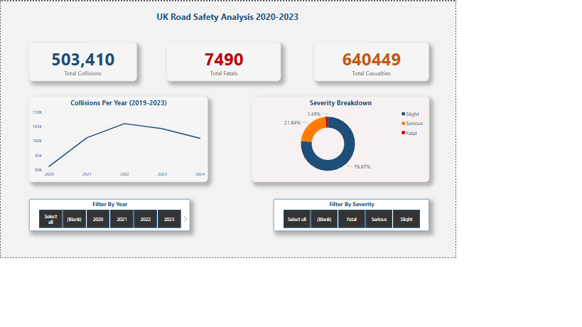
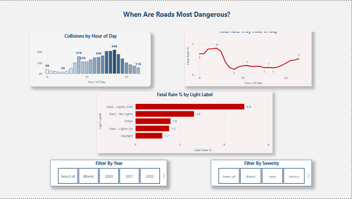
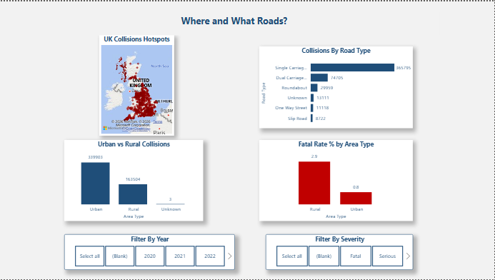

# UK Road Safety Analysis 2020-2024

Analysis of 500,000+ UK government road collision records 
using PostgreSQL and Power BI.

---

## Project Overview

This project investigates what factors make UK road 
collisions more likely to be fatal — analysing patterns 
across time of day, lighting conditions, road type, 
and urban vs rural location.

**Key question:** What makes a collision fatal, not just frequent?

---

## Tools Used

| Tool | Purpose |
|---|---|
| PostgreSQL + pgAdmin | Database design and SQL analysis |
| Power BI Desktop | Interactive 3-page dashboard |
| UK Government Open Data | Dataset source |

---

## Dataset

- Source: https://www.gov.uk/government/statistical-data-sets/road-safety-open-data
- 503,410 collision records across 3 linked tables
- 5 years of data: 2019-2024
- Tables: collisions, vehicles, casualties

---

## Key Findings

- 🕓 Peak collision hour is 5pm (44,000 collisions) but deadliest hour is 4am (4.28% fatal rate)
- 🌙 Dark unlit roads have 4.9% fatal rate — highest of all lighting conditions
- 🛣️ Single carriageway roads account for 365,795 collisions — 72% of all collisions
- 🏡 Rural roads have 2.9% fatal rate vs Urban 0.8% despite far lower traffic volume
- ⚠️ Fatal collisions represent only 1.49% of total but concentrated in specific conditions

---

## Dashboard

[▶ Download Interactive Dashboard (.pbix)]https://drive.google.com/file/d/1rzTM3mprlELC9QmbTgwGNjaNbZycqrrQ/view?usp=sharing

Open in Power BI Desktop to interact with full dashboard
including slicers and filters.

### Overview


### Time & Conditions


### Location & Roads


---

## SQL Files

| File | Contents |
|---|---|
| `sql/01_create_tables.sql` | Database schema for 3 tables |
| `sql/02_load_data.sql` | COPY commands to load CSV data |
| `sql/03_data_cleaning.sql` | Null checks and view creation |
| `sql/04_analysis_queries.sql` | 10 business analysis questions |

---

## Skills Demonstrated

- PostgreSQL database design and management
- Complex SQL — CTEs, window functions, LAG, CASE WHEN, JOINs
- Power BI dashboard with DAX measures and calculated columns
- Data cleaning and validation at scale
- Analytical thinking — distinguishing volume from risk

---

## Project Structure

```
uk-road-safety-analysis/
  README.md
  sql/
    01_create_tables.sql
    02_load_data.sql
    03_data_cleaning.sql
    04_analysis_queries.sql
  screenshots/
    overview.png
    time_conditions.png
    location_roads.png
```
